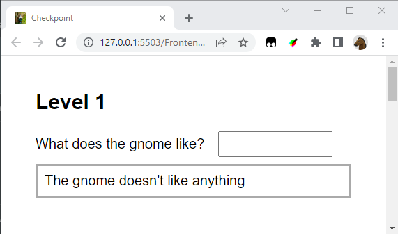
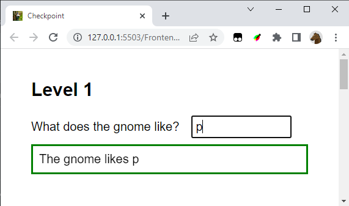
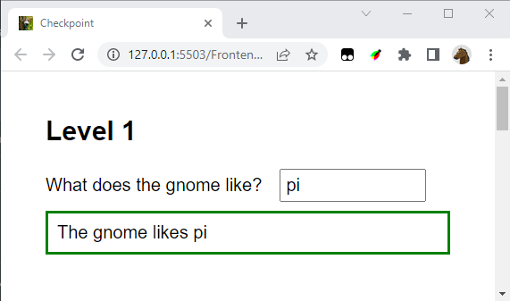
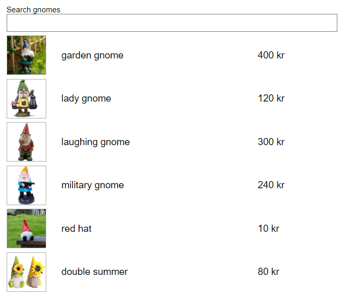
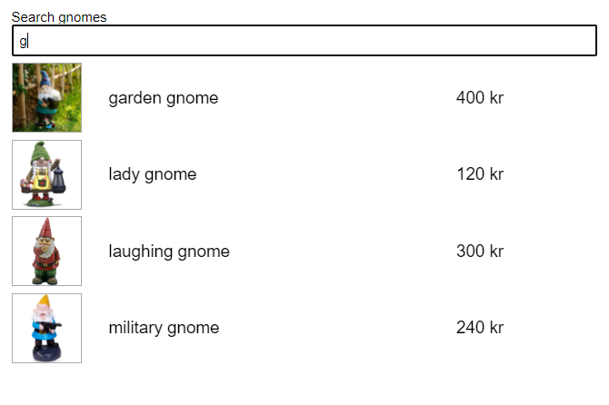
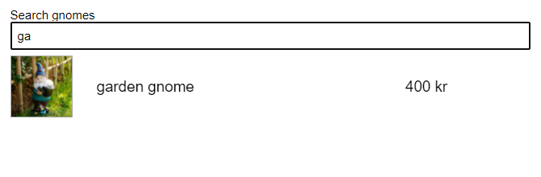
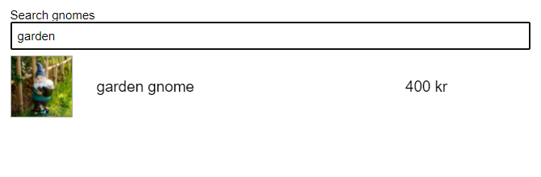
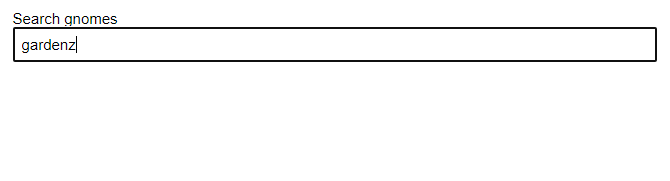

# Checkpoint - Frontend

## Time

2h

## General

Only hand in one file: **checkpoint.js**

Only submit your checkpoint once

You are not allowed to change checkpoint.css or checkpoint.html. Do all your coding in checkpoint.js

Start solving Level 1 (since it's needed to pass Level 2)

You only need to solve Level 1 to pass the checkpoint.

## Get started

Copy the folder **Code** containing:
- gnomes (a folder with images)
- checkpoint.css
- checkpoint.html
- checkpoint.js

...to your **My** folder

Open **checkpoint.html** using Live Server

## Level 1

If there are no text in the input field, show **The gnome doesn't like anything** with a gray frame

If there are text in the input field, show a green border and change the text: 

Same here:

Same here:

The user removes a character:

The user removes a character:

The user removes a character and we are back:

Hint
- In the CSS there are CSS-rule(s) you can use for the border

## Level 2

First solve Level 1

When the page loads, show all gnomes

After a key is pressed, only show gnomes that contain the search text. Here we search for all gnomes that have a description that contains **g**:

Search for **ga**

Search for **garden**

Search for **gardenz**

