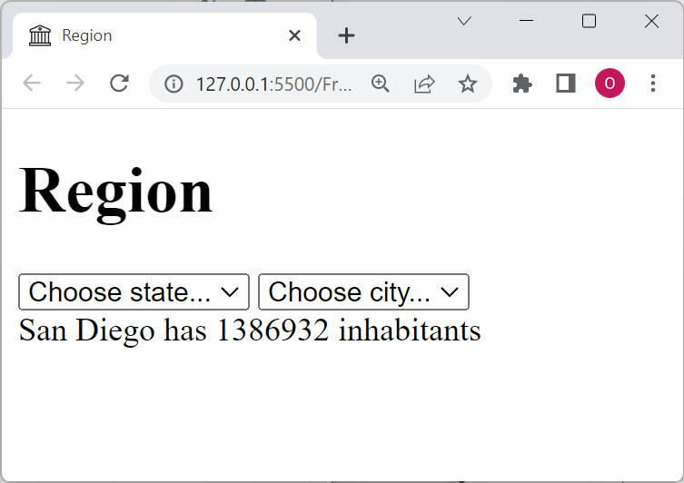

# HTML Exercise

Create a HTML document that looks like this:

Note
- The star favicon and title of the document
- Add some states in the first select-box
- Add some cities in the second select-box
- You don't need to add any logic (nothing will happen when the user select a state)

(don't use CSS or JavaScript)