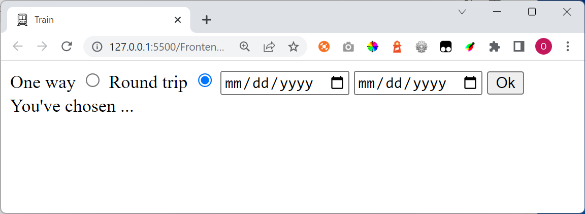

# HTML Exercise

Create a HTML document that looks like this:

Note
- The train favicon and title of the document
- When the page loads, "Round trip" should be chosen 
- If the user presses the text "One way" or "Round trip" then change the radio button state
- Don't use any JavaScript to solve the problems above

