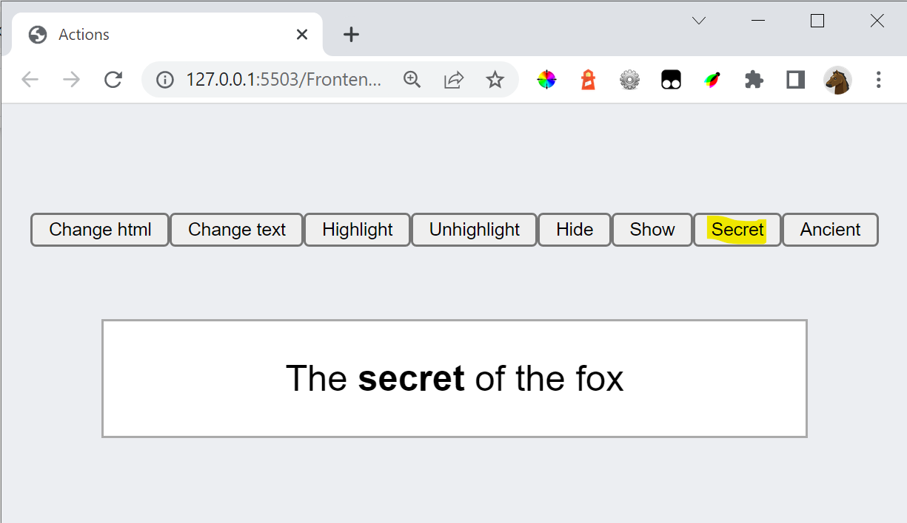
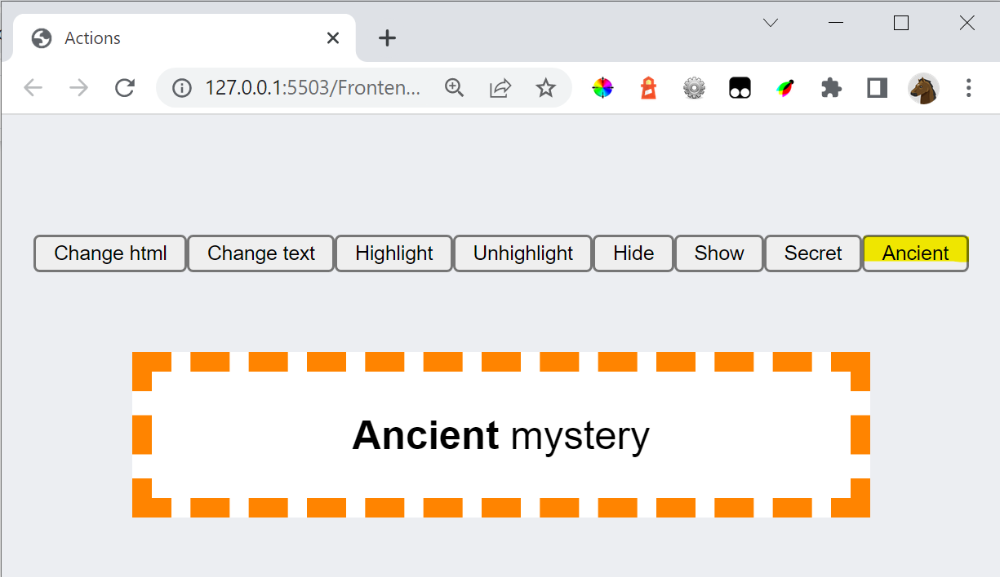
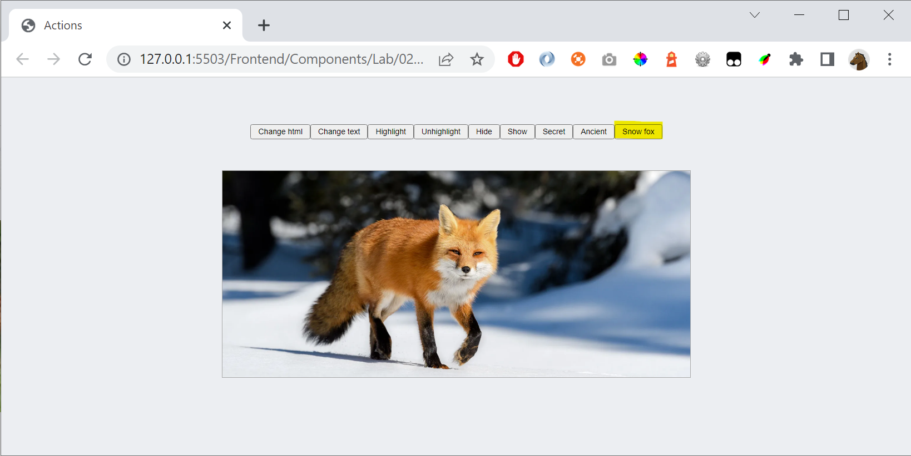

# Exercise

If the Secret-button is pressed, show the text below:

# Exercise

If the Acient-button is pressed, show the text and add the dotted frame:

# Exercise

In **actions.css** add a CSS-rule **fox**, with these properties:

    background-image: url(...);
    background-size: cover;
    width: 320px;
    height: 180px;

Instead of the three dots above you write the name of an image.

When **snow fox** is clicked:

