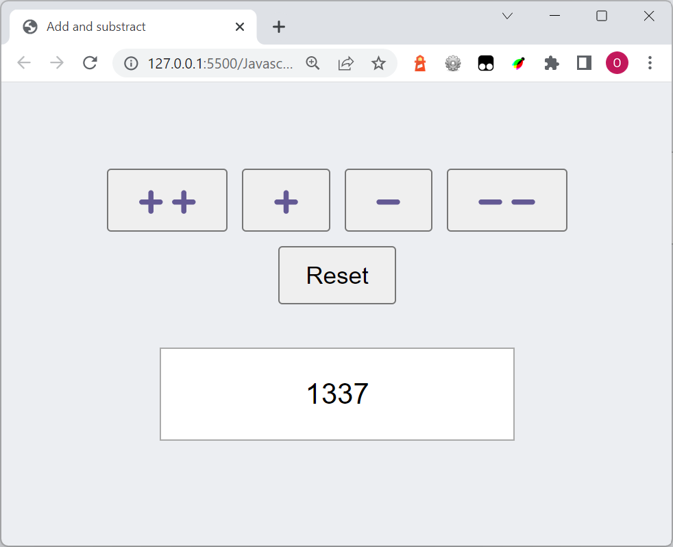
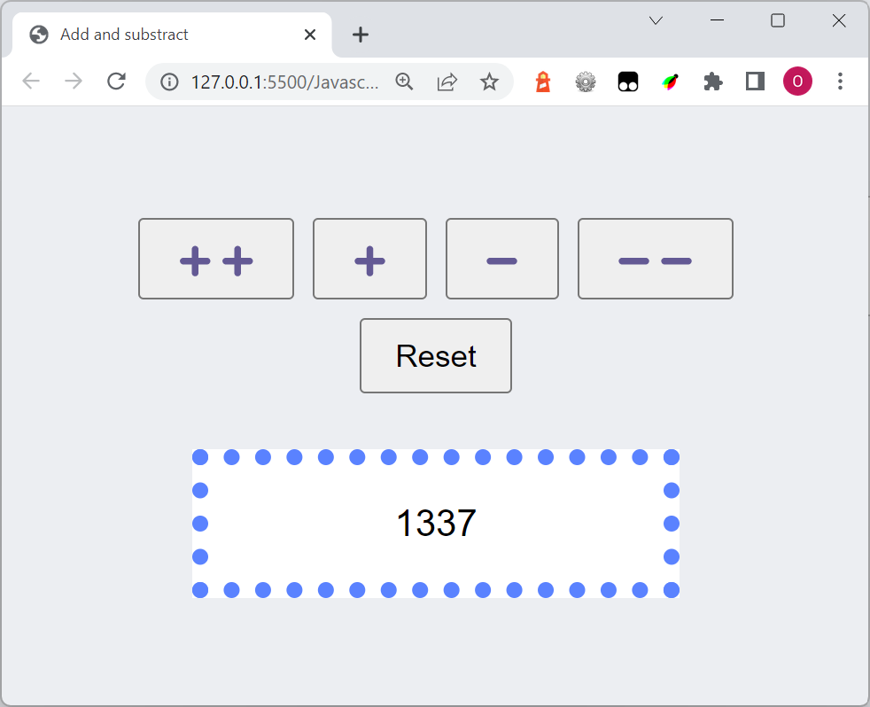

# Exercise

Start with 1337 instead of 0

Add three buttons:

- if **++** is pressed, add 10
- if **--** is pressed subtract 10
- if **Reset** is pressed, change the value to 1337

## Advanced

Continue on the same exercise. 

If the number is odd, show a blue dotted border around the result. Otherwise don't.

Since 1337 is an odd number, we show a blue dotted border in this case:

