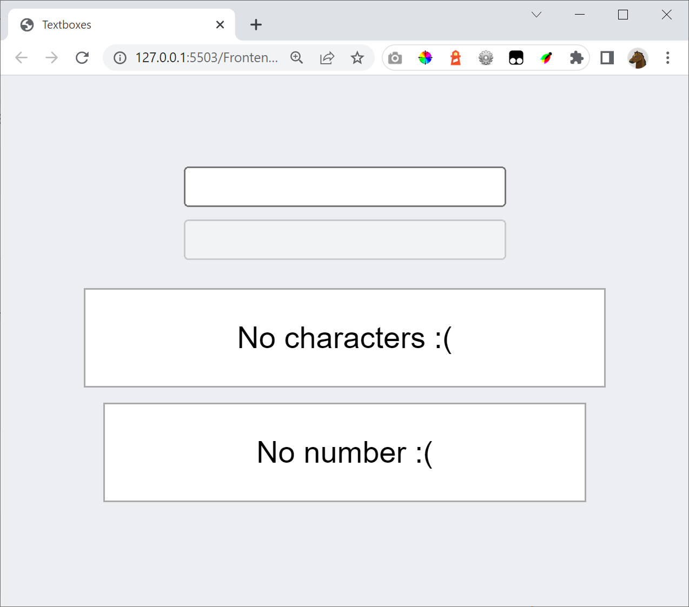
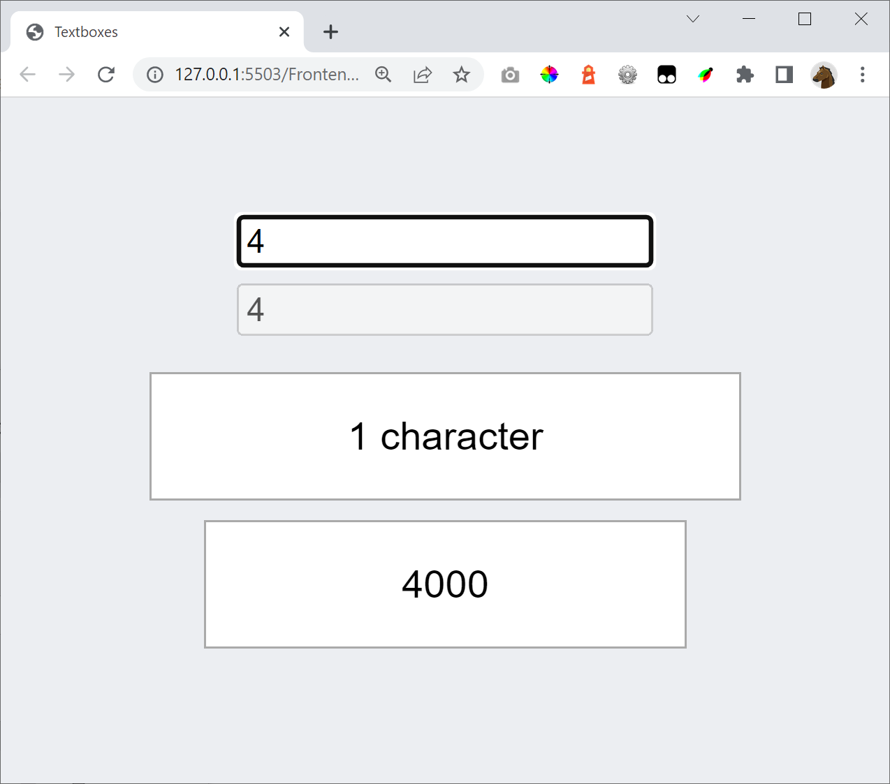
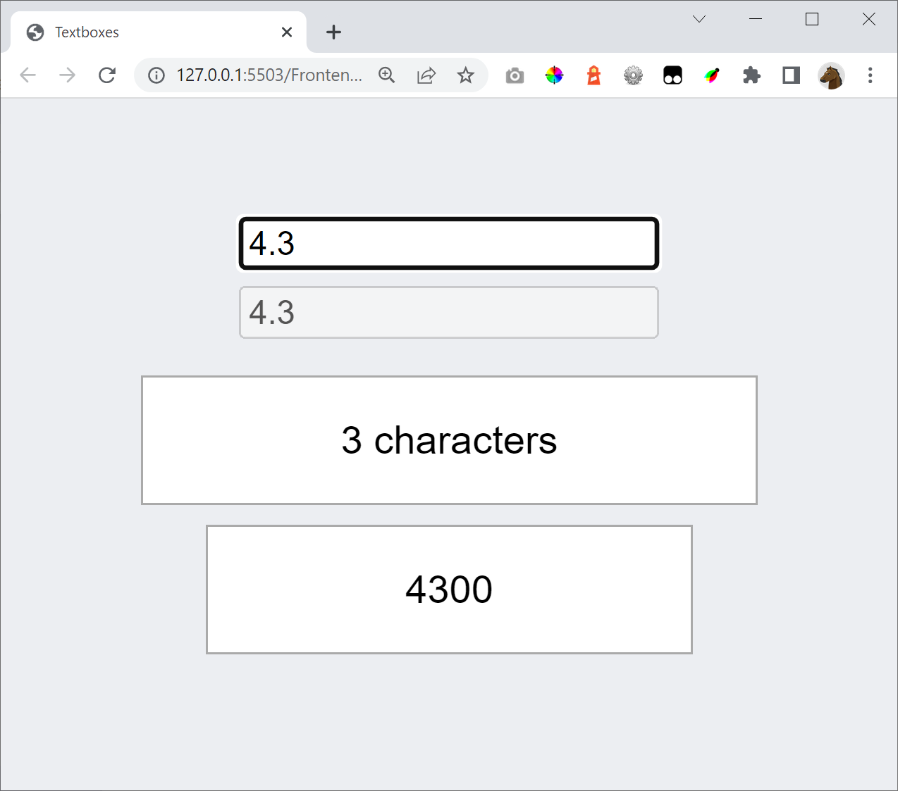
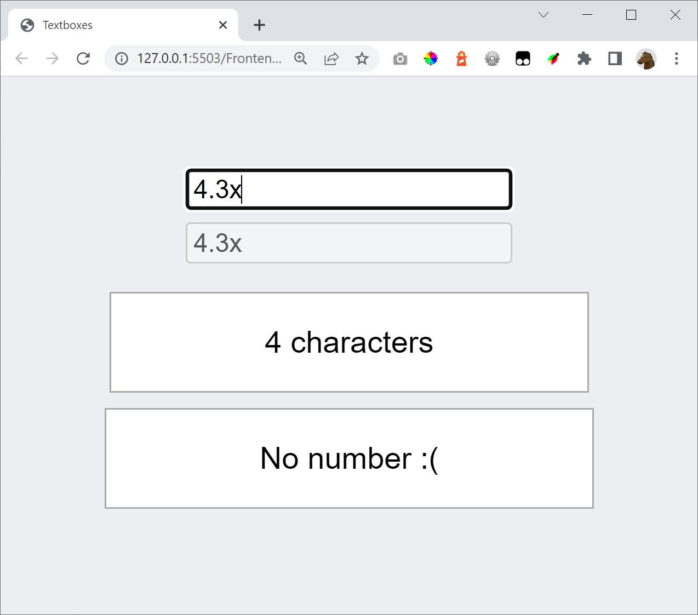

# Exercise

Add a resultarea that shows the inputed number times 1000, if it's a number.

If it's not a number show: **No number :(**

See the screenshots below:

# Hint

To see if a string is a number, use this function

    function isNumeric(str) {
        if (typeof str != "string")
            return false
        return !isNaN(str) && !isNaN(parseFloat(str))
    }

To convert a string to a number use

    parseFloat